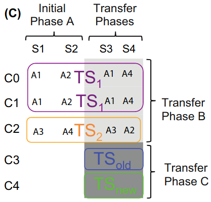
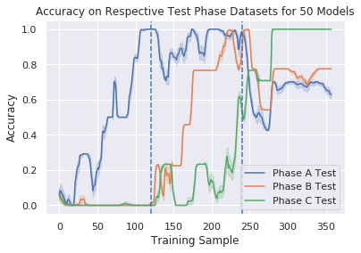

<div align="center">

# Hierarchical Generalization and Learning

</div>

Code that implements the task described in Collins, Frank (2016) task in
[Neural signature of hierarchically structured expectations predicts clustering and transfer of rule sets in reinforcement learning][1].
The package can be installed for general reuse and extension.

<!-- markdown-toc start - Don't edit this section. Run M-x markdown-toc-refresh-toc -->
## Table of Contents

  - [Description](#description)
  - [Getting Started](#getting-started)
    - [Installation](#installation)
    - [Usage](#usage)
  - [Generating Datasets](#generating-datasets)
  - [Example Use-Cases](#example-use-cases)
    - [Training and Testing on Phase Data](#training-and-testing-on-phase-data)

<!-- markdown-toc end -->

## Description

The original task is structured in three phases where participants were presented
with visual stimuli that comprised combinations of shapes and colors. They were
then asked to select one of four keys corresponding to the correct action for
that particular shape and color combination. For all phases, below is figure 1C
showing the mapping from shapes and colors to actions:

 

Here the shapes correspond to S1 through S4, the colors correspond to C0 to C4,
and the actions correspond to A1 to A4. Participants were shown the stimuli in
phases, but the stimuli can also be grouped into different task-sets.

This repo implements the task computationally using horizontal and vertical bars
on a numpy array, corresponding to color and shape in the original task.

## Getting Started

### Installation

To use the package, first clone it:

```bash
git clone https://github.com/APRashedAhmed/hierarchical-generalization.git
```

Install the requirements:

```bash
# For pip
pip install requirements.txt

# For conda
conda install `cat requirements.txt` -c conda-forge
```

And then install the repo using `pip`:
```bash
# Local install
pip install .
```

Note: If planning on making changes to the code, it is better to install using
the `setup.py` file directly:
```bash
python setup.py develop
```
Installing in this way will allow code changes to be reflected when importing,
whereas installing with `pip` does not.

### Usage

Once installed, the repo functions similarly to any package installed by `pip`
or `conda` and can be imported:

```python
# Import and alias the whole package
import hierarchical_generalization as hg

# Import a specific module
from hierarchical_generalization import taskset as ts

# Import a specific function
from hierarchical_generalization.make_datasets import generate_task_data
```
<br>

## Generating Datasets

The main way to use the package is through the high-level data generation
functions in [`make_datasets.py`](hierarchical_generalization/make_datasets.py). 

1. `generate_phase_train_test_data` - Generates the training and testing data
as dictionaries keyed by the different phases.

```python
from hierarchical_generalization.make_datasets import generate_phase_train_test_data

# Outputs the training and testing
train_data, test_data = generate_phase_train_test_data() 
```

2. `generate_taskset_test_data` - Generates an auxiliary testing set 
dictionary that is separated by the different task sets.

```python
from hierarchical_generalization.make_datasets import generate_taskset_test_data

# Outputs the taskset test data
ts_test_data = generate_taskset_test_data()
```

3. `generate_task_data` - Generates the phase train, phase test, and task-set
test datasets and ensures the arguments are consistent between the three.

```python
from hierarchical_generalization.make_datasets import generate_task_data

# Outputs the taskset test data
phase_train_data, phase_test_data, ts_test_data = generate_task_data()
```

## Example Use-Cases

The examples below will show pseudocode of how the task has been used previously, 
and therefore how it can be used going forward. For illustrative purposes, 
training curves of a multilayer perceptron (MLP) are shown, along with how to 
interpret the graphs. The MLP has `N_COLORS * N_SHAPES` input units, `100`
hidden units, and `N_ACTIONS` output units. For all figures, the model is rerun
`50` times with random initialization.

### Training and Testing on Phase Data

The task structure calls for serial training on each phase of the data. This can
be done by looping through the resulting phases and training on each serially,
while testing on all phases after every sample to visualize how well the model
performs on stimuli from each phase as a function of the phase and number of
samples it has seen:

```python
import hierarchical_generalization.default_configuration as cfg
from hierarchical_generalization.make_datasets import generate_phase_train_test_data

# Define the data
train_phase_data, test_phase_data = generate_phase_train_test_data() 

# Define a model
model = MLP(input=cfg.N_COLORS*cfg.N_SHAPES, hidden=100, output=cfg.N_ACTIONS)

# Loop through each phase
for train_phase, test_data in train_phase_data.items():
    # Train on that particular phase
    for X, y in train_data:
        # Some training function
        train(model, X, y) 
		
        # Test the model on all the phase data
        for test_phase, test_data in test_phase_data.items():
            # Some evaluation function that keeps track of the accuracy
            metrics = evaluate_model(model, test_data)
			
# Plot the metrics with some plotting function
plot_metrics(metrics)
```

 

The plot shows three curves corresponding to the testing set for phase A, B, and
C, as a function of samples the model is shown. The vertical dashed line 
indicates the end of one phase and the start of the next. 

As expected during the first phase (A), the accuracy of the phase A testing set 
steadily increases until the end of the phase. This pattern applies to the phase
B and C testing sets for the middle and rightmost training phases respectively.
Interestingly the performance on phase A remains high through phase B training
and only begins to drop in phase C. Additionally, performance on phase C begins
to increase by the end of phase B, perhaps indicating some level of 
generalization. Training on phase C seems to cause catastrophic interference
with what was learned in phases A and B, as indicated by the dip in performance
on those testing sets.

<!-- Markdown References -->

[1]: https://pubmed.ncbi.nlm.nih.gov/27082659/
